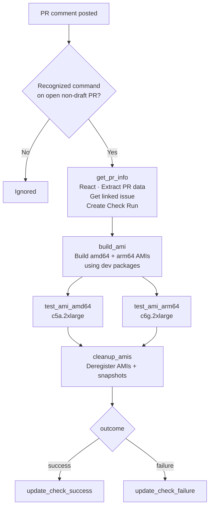
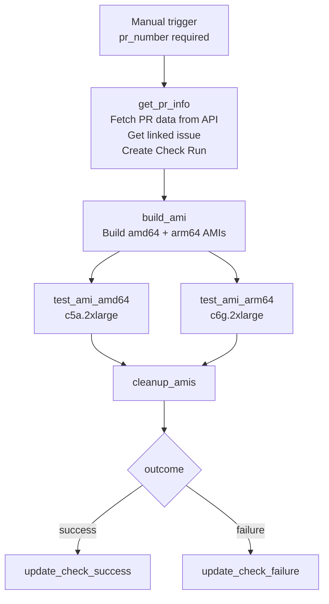

# AMI Integration Tests

Workflow file: `.github/workflows/5_check_integration_ami.yaml`

This workflow builds AMI images for both amd64 and arm64 architectures from the PR branch, launches EC2 instances from each AMI, and runs the integration test suite against the live instances in parallel. After testing, the AMI images and their EBS snapshots are deregistered.

The workflow delegates image building to the reusable `.github/workflows/5_AMI_builder.yaml` workflow, and test execution to the shared `.github/workflows/5_test-vm.yaml` workflow (also used by the OVA workflow).

---

## Triggers

| Mode | Trigger | Who can trigger |
|---|---|---|
| PR comment | `issue_comment` on an open, non-draft PR | Any repo collaborator |
| Manual | `workflow_dispatch` | Anyone with repo write access |

---

## Execution Flows

### issue_comment flow



**Recognized commands:** `/test-integration` or `/test-ami`

### workflow_dispatch flow



---

## Parameters

### workflow_dispatch inputs

| Input | Required | Default | Description |
|---|---|---|---|
| `pr_number` | Yes | — | PR number to test |
| `pr_head_ref` | No | — | PR branch name; fetched from GitHub API if not provided |
| `pr_head_sha` | No | — | PR commit SHA; fetched from GitHub API if not provided |
| `wazuh_automation_reference` | No | `5.0.0` | Branch or tag of `wazuh-automation` to use |

### issue_comment parameters

| Parameter | Source |
|---|---|
| `pr_number` | Issue number from the comment event |
| `pr_head_ref` | Fetched from GitHub API using the PR number |
| `pr_head_sha` | Fetched from GitHub API using the PR number |
| `wazuh_automation_reference` | Fixed: `main` |

---

## Job Details

### Job 1 — `get_pr_info` (both triggers)

| Step | What it does |
|---|---|
| React to comment | Adds a 🚀 reaction (issue_comment only) |
| Extract PR data | Resolves `pr_head_ref` and `pr_head_sha` from inputs or GitHub API |
| Get linked issue | Queries the GitHub GraphQL API for the closing issue linked to the PR; result is passed to the builder |
| Create Check Run | Creates an `AMI Build & Test` Check Run in `in_progress` state on the PR head SHA |

Outputs: `issue_url`, `pr_number`, `pr_head_ref`, `pr_head_sha`, `check_run_id`, `wazuh_automation_reference`.

### Job 2 — `build_ami` (reusable workflow)

Calls `.github/workflows/5_AMI_builder.yaml` with:

| Parameter | Value |
|---|---|
| `id` | `pr-check-{pr_number}` |
| `wazuh_virtual_machines_reference` | `pr_head_ref` |
| `wazuh_automation_reference` | `wazuh_automation_reference` |
| `is_stage` | `true` |
| `ami_revision` | `check-pr` |
| `wazuh_package_type` | `dev` |
| `architecture` | `["amd64", "arm64"]` |
| `commit_list` | `["latest","latest","latest","latest","latest"]` |
| `customizer_debug` | `false` |
| `destroy` | `true` |
| `issue` | `issue_url` from `get_pr_info` |
| `is_pr_check` | `true` |

Outputs used by downstream jobs: `ami_id_amd64`, `ami_id_arm64`.

Both architectures are built in the same workflow invocation. `test_ami_amd64` and `test_ami_arm64` only proceed if their respective AMI ID output is non-empty.

### Job 3 — `test_ami_amd64` and `test_ami_arm64` (parallel, reusable workflow)

Both jobs call `.github/workflows/5_test-vm.yaml` with `test_type: ami`. They run concurrently:

| Parameter | amd64 | arm64 |
|---|---|---|
| `test_type` | `ami` | `ami` |
| `host` | `ami_id_amd64` | `ami_id_arm64` |
| `instance_type` | `c5a.2xlarge` | `c6g.2xlarge` |
| `TESTS` | `ALL` | `ALL` |
| `log_level` | `INFO` | `INFO` |

**Inside the `5_test-vm.yaml` reusable workflow — AMI path:**

The workflow runs three jobs in sequence: `ami-setup` → `test-ami` → `ami-cleanup`.

**`ami-setup`:**

1. Configure AWS credentials (`AWS_IAM_OVA_ROLE`)
2. Generate an RSA SSH key pair and import the public key to EC2
3. Launch an EC2 instance from the AMI ID:
   ```bash
   aws ec2 run-instances \
     --image-id {ami_id} \
     --instance-type {c5a.2xlarge | c6g.2xlarge} \
     --key-name {KEY_NAME} \
     --security-group-ids {AWS_EC2_SG}
   ```
   Tags: `Name={KEY_NAME}`, `AutoTerminate=true`, `CreatedBy=test_runner`
4. Wait for instance to reach `running` state, then retrieve public IP
5. Wait up to 15 minutes for SSH port 22 to become available (polls every 30 seconds, 60-second initial boot delay)
6. Upload SSH private key as artifact (`ssh-key-{KEY_NAME}`, retained 1 day)

**`test-ami`:**

1. Checkout `wazuh-automation` at `wazuh_automation_reference`
2. Set up Python 3.10 and install `integration-test-module`
3. Download SSH key artifact
4. Run integration tests:
   ```bash
   test_runner \
     --test-type ami \
     --ssh-host {instance_ip} \
     --ssh-key-path /tmp/ssh/{KEY_NAME} \
     --test-pattern ALL \
     --log-level INFO \
     --output github \
     --output-file test-results.github
   ```
5. Parse results into `$GITHUB_ENV` and write step summary
6. Post or update PR comment (marker: `<!-- wazuh-vm-test-ami-amd64 -->` or `<!-- wazuh-vm-test-ami-arm64 -->`)

**`ami-cleanup` (always runs unless `keep_instance_alive` is set):**

1. Terminate the EC2 instance (`aws ec2 terminate-instances` + wait)
2. Delete the SSH key pair from EC2

For details on what the `ami` test type validates, see the `Integration Test Module — Description` of the internal documentation.

### Job 4 — `cleanup_amis` (always runs if `build_ami` was not skipped)

Deregisters both AMIs and their associated EBS snapshots:

```bash
aws ec2 deregister-image --image-id {AMI_ID}
aws ec2 delete-snapshot --snapshot-id {SNAPSHOT_ID}
```

Each AMI ID is validated against the pattern `ami-[0-9a-f]{17}` before deregistration. Runs even if tests failed.

### Jobs 5/6 — `update_check_success` / `update_check_failure`

Two separate jobs handle the final Check Run update based on overall workflow outcome:

| Trigger condition | Conclusion | Output |
|---|---|---|
| `if: success()` | `success` — ✅ AMI Build & Test - Success | Lists both AMI IDs and confirms tests passed |
| `if: failure()` | `failure` — ❌ AMI Build & Test - Failed | Lists which step(s) failed (`Build AMI`, `Test amd64`, `Test arm64`) |

---

## Required Secrets and Variables

### Secrets

| Secret | Used by |
|---|---|
| `AWS_IAM_OVA_ROLE` | OIDC role for all AWS operations (build, test, cleanup) |
| `GH_CLONE_TOKEN` | Checkout `wazuh-automation` in test job |
| `AWS_EC2_SG` | Security group for EC2 test instances |
| `GITHUB_TOKEN` | Check Run updates (built-in) |

### Repository variables

| Variable | Used by |
|---|---|
| `AWS_S3_BUCKET_DEV` | Dev package artifact URL generation in the builder |

---

## Permissions

| Permission | Purpose |
|---|---|
| `id-token: write` | OIDC authentication to AWS |
| `contents: read` | Checkout repository |
| `pull-requests: write` | Post PR comments |
| `issues: write` | Post comments via issues API |
| `checks: write` | Create and update GitHub Check Runs |
