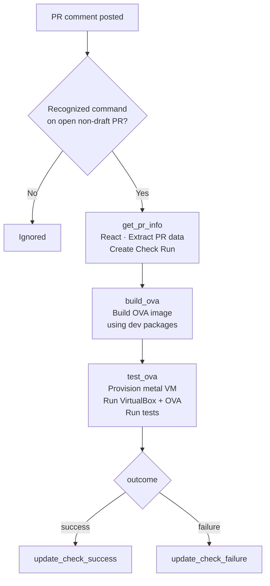
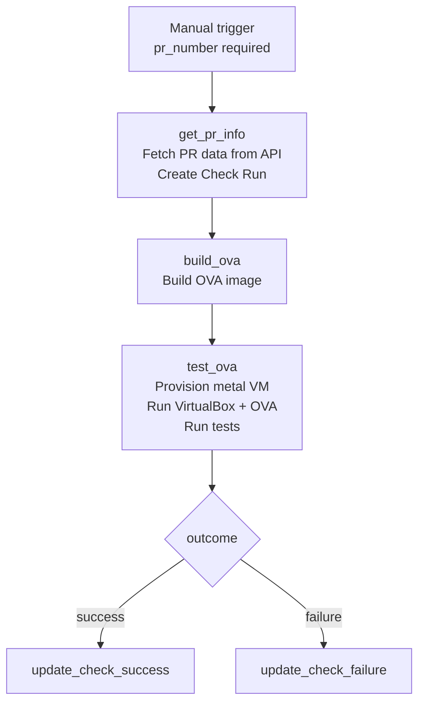

# OVA Integration Tests

Workflow file: `.github/workflows/5_check_integration_ova.yaml`

This workflow builds an OVA image from the PR branch, provisions an EC2 bare-metal instance, imports the OVA into VirtualBox running on that instance, and runs the integration test suite against the virtual machine via SSH port forwarding.

The workflow delegates image building to the reusable `.github/workflows/5_OVA_builder.yaml` workflow, and test execution to the shared `.github/workflows/5_test-vm.yaml` workflow (also used by the AMI workflow).

---

## Triggers

| Mode | Trigger | Who can trigger |
|---|---|---|
| PR comment | `issue_comment` on an open, non-draft PR | Any repo collaborator |
| Manual | `workflow_dispatch` | Anyone with repo write access |

---

## Execution Flows

### issue_comment flow



**Recognized commands:** `/test-integration` or `/test-ova`

### workflow_dispatch flow



---

## Parameters

### workflow_dispatch inputs

| Input | Required | Default | Description |
|---|---|---|---|
| `pr_number` | Yes | — | PR number to test |
| `pr_head_ref` | No | — | PR branch name; fetched from GitHub API if not provided |
| `pr_head_sha` | No | — | PR commit SHA; fetched from GitHub API if not provided |
| `wazuh_automation_reference` | No | `1.2.3` | Branch or tag of `wazuh-automation` to use |

### issue_comment parameters

| Parameter | Source |
|---|---|
| `pr_number` | Issue number from the comment event |
| `pr_head_ref` | Fetched from GitHub API using the PR number |
| `pr_head_sha` | Fetched from GitHub API using the PR number |
| `wazuh_automation_reference` | Fixed: `main` |

---

## Job Details

### Job 1 — `get_pr_info` (both triggers)

| Step | What it does |
|---|---|
| React to comment | Adds a 🚀 reaction (issue_comment only) |
| Extract PR data | Resolves `pr_head_ref` and `pr_head_sha` from inputs or GitHub API |
| Create Check Run | Creates an `OVA Build & Test` Check Run in `in_progress` state on the PR head SHA |

Outputs: `pr_number`, `pr_head_ref`, `pr_head_sha`, `pr_head_sha_short`, `check_run_id`, `wazuh_automation_reference`.

### Job 2 — `build_ova` (reusable workflow)

Calls `.github/workflows/5_OVA_builder.yaml` with:

| Parameter | Value |
|---|---|
| `id` | `pr-check-{pr_number}` |
| `wazuh_virtual_machines_reference` | `pr_head_ref` |
| `wazuh_automation_reference` | `wazuh_automation_reference` |
| `is_stage` | `false` |
| `ova_revision` | `PR-{pr_number}` |
| `wazuh_package_type` | `dev` |
| `commit_list` | `["latest","latest","latest","latest","latest"]` |
| `destroy` | `true` |
| `checksum` | `false` |
| `is_pr_check` | `true` |

### Job 3 — `test_ova` (reusable workflow)

Calls `.github/workflows/5_test-vm.yaml` with:

| Parameter | Value |
|---|---|
| `test_type` | `ova` |
| `wazuh_package_type` | `dev` |
| `commit_list` | `["latest","latest","latest","latest","latest"]` |
| `TESTS` | `ALL` |
| `log_level` | `INFO` |
| `ova_revision` | `latest` |

**Inside the `5_test-vm.yaml` reusable workflow — OVA path:**

The workflow runs three jobs in sequence: `ova-setup` → `test-ova` → `ova-cleanup`.

**`ova-setup`:**

1. Checkout `wazuh-virtual-machines` and `wazuh-automation`
2. Configure AWS credentials (`AWS_IAM_OVA_ROLE`)
3. Set up Python 3.12 and install allocator dependencies
4. Read `version` and `stage` from `wazuh-virtual-machines/VERSION.json`
5. **Resolve OVA artifact URL** based on `wazuh_package_type`:
   - `dev`: generate presigned S3 URLs using `generate_presigned_dev_urls.py --process test_ova` with per-component `commit_list` revisions → writes `/tmp/{ARTIFACT_URL_FILE_NAME}`
   - `pre-prod`: download from pre-release packages URL
   - `prod`: download from production packages URL
   - Extract `wazuh_ova` field from the resulting `artifact_urls.yaml`
6. **Provision allocator instance** — a bare-metal EC2 instance required for nested virtualization:
   ```bash
   python wazuh-automation/deployability/modules/allocation/main.py \
     --action create \
     --provider aws \
     --size metal \
     --composite-name amazon-2023-amd64 \
     --instance-name gha_{run_id}_ova_test \
     --label-team devops \
     --label-termination-date 1d
   ```
   Extracts `allocator_ip`, `ssh_key`, `ssh_user`, `ssh_port` from the generated inventory.
7. **Install VirtualBox on the allocator** (via SSH):
   ```bash
   git clone https://github.com/wazuh/wazuh-virtual-machines.git /tmp/wazuh-virtual-machines
   cd /tmp/wazuh-virtual-machines && sudo hatch run dev-ova-dependencies:install
   VBoxManage --version  # verify
   ```
8. **Download OVA** from the presigned URL (curl) or S3 (aws s3 cp)
9. **Transfer OVA to allocator** via SCP
10. **Import and start VM in VirtualBox**:
    ```bash
    VBoxManage import {ova_path} --vsys 0 --vmname wazuh-ova-test-{run_id}
    VBoxManage modifyvm {VM_NAME} --memory 16384 --cpus 8 --nic1 nat
    VBoxManage startvm {VM_NAME} --type headless
    ```
11. **Configure SSH port forwarding**: power off the VM, add NAT rule `guest:22 → host:2201`, restart headless
12. **Wait for OVA VM SSH** — polls `nc -z localhost 2201` on the allocator for up to 10 minutes
13. Upload allocator working directory as artifact for cleanup

**`test-ova`:**

1. Checkout `wazuh-automation` at `wazuh_automation_reference`
2. Set up Python 3.10 and install `integration-test-module`
3. Run integration tests using SSH password authentication through the allocator's port-forwarded SSH:
   ```bash
   test_runner \
     --test-type ova \
     --ssh-host {allocator_ip} \
     --ssh-port 2201 \
     --ssh-username wazuh-user \
     --ssh-password wazuh \
     --test-pattern ALL \
     --log-level INFO \
     --output github \
     --output-file test-results.github
   ```
   > The OVA VM is not directly reachable — connections go through the allocator at port 2201, which VirtualBox forwards to the VM's SSH port 22. The OVA uses default credentials (`wazuh-user` / `wazuh`).
4. Parse results into `$GITHUB_ENV` and write step summary
5. Post or update PR comment (marker: `<!-- wazuh-vm-test-ova -->`)

For details on what the `ova` test type validates, see the `Integration Test Module — Description` of the internal documentation.

**`ova-cleanup` (always runs):**

1. Download the allocator working directory artifact (uploaded in `ova-setup`)
2. Update paths in `track.yml` to match the download location
3. Terminate the allocator instance via the `deployability` allocator:
   ```bash
   python wazuh-automation/deployability/modules/allocation/main.py \
     --action delete \
     --track-output {track_file}
   ```
   Terminating the allocator instance also stops the VirtualBox VM running inside it.

### Jobs 4/5 — `update_check_success` / `update_check_failure`

Two separate jobs handle the final Check Run update:

| Trigger condition | Conclusion | Output |
|---|---|---|
| `if: success()` | `success` — ✅ OVA Build & Test - Success | Confirms OVA built and tests passed |
| `if: failure()` | `failure` — ❌ OVA Build & Test - Failed | Reports `build_ova` and `test_ova` outcomes |

---

## Required Secrets and Variables

### Secrets

| Secret | Used by |
|---|---|
| `AWS_IAM_OVA_ROLE` | OIDC role for all AWS operations (build, allocator, cleanup) |
| `GH_CLONE_TOKEN` | Checkout `wazuh-automation` and `wazuh-virtual-machines` |
| `GITHUB_TOKEN` | Check Run updates (built-in) |

### Repository variables

| Variable | Used by |
|---|---|
| `AWS_S3_BUCKET_DEV` | Dev package presigned URL generation |
| `AWS_S3_BUCKET_ARTIFACTS` | Alternate dev artifact bucket reference |
| `ARTIFACT_URL_FILE_NAME` | Filename for the local artifact URLs file |
| `PACKAGES_PROD_URL` | Production packages base URL |
| `PACKAGES_STAGING_URL` | Pre-release packages base URL |

---

## Permissions

| Permission | Purpose |
|---|---|
| `id-token: write` | OIDC authentication to AWS |
| `contents: read` | Checkout repository |
| `pull-requests: write` | Post PR comments |
| `issues: write` | Post comments via issues API |
| `checks: write` | Create and update GitHub Check Runs |

---

## Instance Naming

The allocator EC2 instance (bare-metal, hosts VirtualBox) is named:

```
gha_{github.run_id}_ova_test
```

It is tagged with `termination-date: 1d` as a safety net. The VirtualBox VM running inside it is named `wazuh-ova-test-{run_id}` and does not have a separate EC2 presence.
